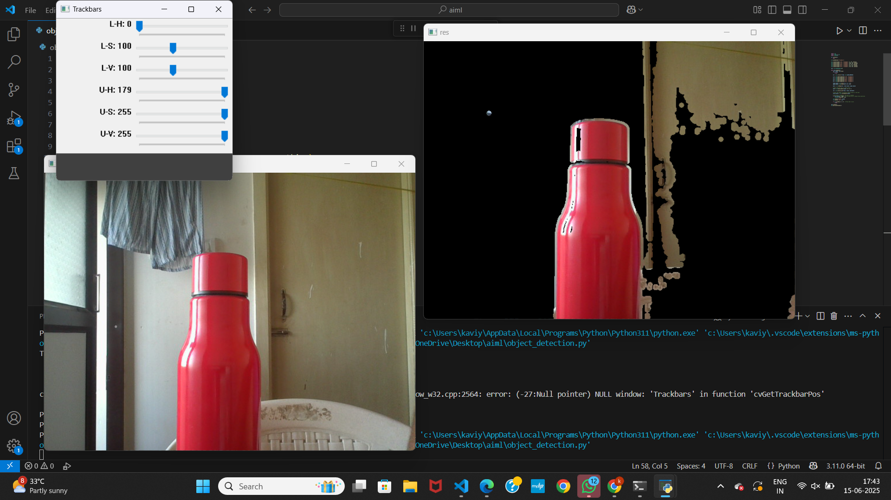

# Tracking Using HSV

In this Example I tried to track objects with blue colors. (Red is life 😎).

I used Trackbars to manipulate the values for red  range, the following results are expressed in terms of `lowerValue(71,112,112)` up to `(255,255,255)`.

## Required Modules :

- **Numpy**

```bash
pip install numpy
pip install opencv-python

